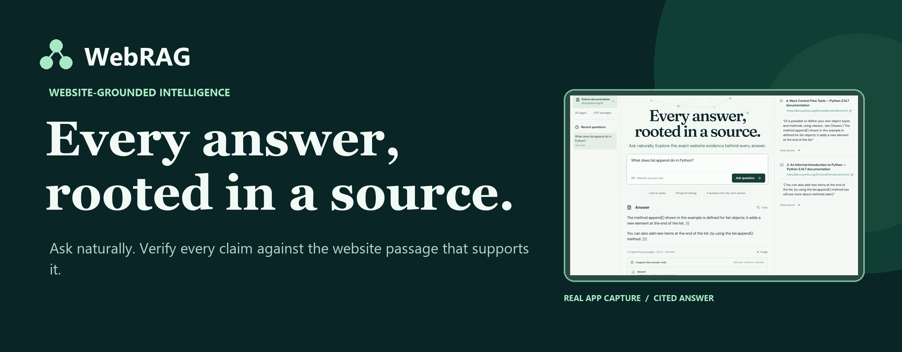
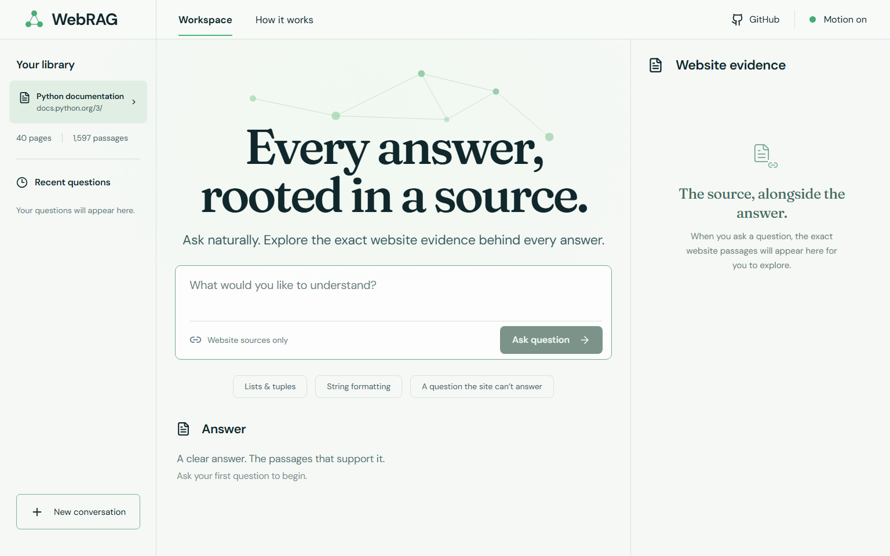
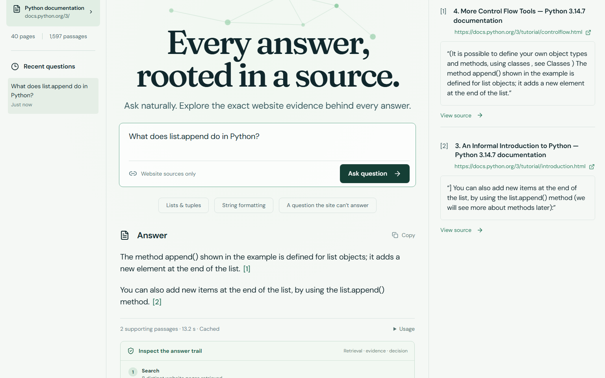
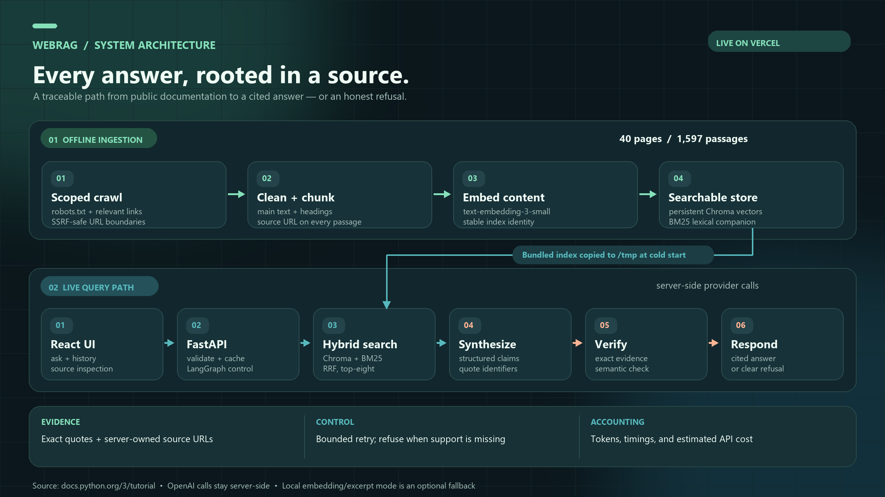
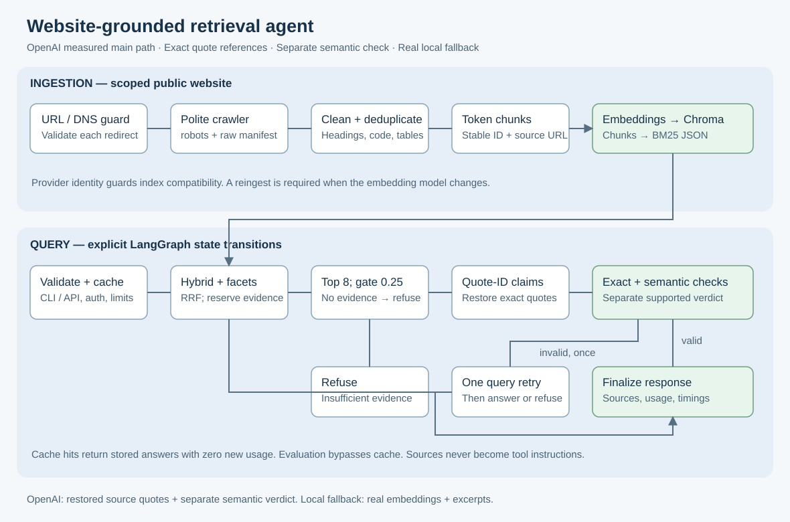

# WebRAG — Grounded Website Intelligence Agent



**Ask a public website. Get an answer you can trace to its exact passages—or an honest refusal.** WebRAG is a complete, deployed website-grounded RAG agent built around a 40-page snapshot of the official Python documentation.

[**Live application**](https://webrag-assessment.vercel.app/) · [**Recorded demo (Google Drive)**](https://drive.google.com/file/d/1KYgEdw04ZEYN9u-ptXm3PXSmMiI-nF47/view?usp=sharing) · [**Submission ZIP**](https://github.com/9059Rohith/WebRAG-Grounded-Website-Intelligence-Agent/raw/refs/heads/main/submission/WebRAG-Assessment-Submission.zip) · [**Project poster**](docs/media/webrag-project-poster.png) · [**Architecture**](docs/architecture.md) · [**Cost analysis**](COST_ANALYSIS.md)

The recorded demo first shows the deployed application answering and refusing real questions, then tours the published README, architecture, evaluation, and costs. The candidate's webcam is damaged; the screen presentation discloses its synthetic narration.

## Recorded demonstration

[](https://drive.google.com/file/d/1KYgEdw04ZEYN9u-ptXm3PXSmMiI-nF47/view?usp=sharing)

[Watch the assessment demo on Google Drive](https://drive.google.com/file/d/1KYgEdw04ZEYN9u-ptXm3PXSmMiI-nF47/view?usp=sharing). It shows the live question-to-answer flow, source URLs and quotations, an unsupported-question refusal, the application on mobile, and the repository's architecture and measured results.

## Assessment submission map

| Required component | Where to find it |
|---|---|
| 1. Source code | [`src/rag_agent/`](src/rag_agent), [`web/`](web), [`tests/`](tests), [locked requirements](requirements.txt), and safe [`.env.example`](.env.example) |
| 2. README | This document: setup, technical decisions, evaluation, security, and limitations |
| 3. Architecture diagrams | [System overview](docs/architecture-showcase.png), [detailed flow](docs/architecture.svg), and [annotated architecture](docs/architecture.md) |
| 4. Cost analysis | [Observed ingestion and query usage, example question, and 100/1,000/10,000-query scenarios](COST_ANALYSIS.md) |
| 5. Recorded walkthrough | [Google Drive demo](https://drive.google.com/file/d/1KYgEdw04ZEYN9u-ptXm3PXSmMiI-nF47/view?usp=sharing) |

The project source is released under the [MIT License](LICENSE). Crawled Python documentation and third-party packages retain their own terms.

## Why this exists

Generic chat can answer confidently without showing where an answer came from. WebRAG treats one crawled website as the authority. It saves original URLs and passages through ingestion, retrieves both semantically and lexically, and returns only answers that its verification path can bind to stored evidence. When the indexed website does not support a question, it says so.

## See the product

| Start with a question | Inspect the grounded result |
|---|---|
|  |  |

The core journey is **ask → retrieve → verify → answer with sources, or refuse**. Select a citation to focus its quotation; open **Inspect the answer trail** to see retrieved page count, supporting passages, decision, stage timings, and a copyable answer with source URLs. [More real desktop and mobile captures](docs/media/README.md) show the explanation dialog, citation focus, refusal, and responsive evidence panel.

## What is working

| Capability | Verified state | Implementation |
|---|---|---|
| Public-site ingestion | Working; 40 saved pages | Scoped, robots-aware Python crawler |
| Searchable knowledge base | Working; 1,597 passages | OpenAI embeddings, persistent Chroma, BM25 |
| Grounded answering | Working with documented misses | LangGraph, GPT-4o mini, server-restored quotations |
| Clear refusal | Working with documented false-refusal risk | Relevance gate, source checks, bounded retry |
| Reviewer-facing evidence | Working on desktop and mobile | React citations, original URLs, answer trail |
| Token and cost disclosure | Working; estimate, not invoice | Per-query usage and [cost report](COST_ANALYSIS.md) |
| CLI and HTTP API | Working | Typer and FastAPI |
| Hosted CI | Workflow configured; jobs blocked by account billing | GitHub Actions; [current status](docs/ci/README.md) |

**Current measured snapshot:** 40 pages; 1,597 passages. The inspected 38-question follow-up regression recorded 37/38 correct answerability decisions, 10/10 unanswerable refusals, and 61/61 exact quotation-provenance checks, with one false refusal. These are inspected regression questions, **not a fresh independent holdout**. The original independent 12-question baseline had two false refusals among eight answerable questions. [Read the evaluation and its limits](evaluation/results/followup_regression/EVALUATION.md).

## Architecture at a glance



The owner-operated crawl cleans and chunks website content, then builds Chroma vectors and a BM25 companion index. The deployed React workspace calls the same-origin FastAPI service; LangGraph retrieves, gates, synthesizes, verifies, and returns an answer with stored URLs or a refusal. The prepared index ships with the Vercel deployment; reingestion is an explicit owner step. [Detailed architecture and graph](docs/architecture.md).

### Grounding and refusal path



The lower branch shows the critical trust boundary: the model selects quote IDs, while the server restores the exact saved passages and original URLs. Invalid citations or unsupported claims trigger one bounded retry, then a clear refusal. [See the executable LangGraph transitions and deployment diagram](docs/architecture.md).

## Stack and repository map

| Layer | Actual technology | Where to inspect |
|---|---|---|
| Interface | React, TypeScript, Vite, local fonts | [`web/src`](web/src) |
| API and agent | FastAPI, Pydantic, LangGraph, LangChain OpenAI | [`src/rag_agent`](src/rag_agent) |
| Retrieval and storage | OpenAI embeddings, Chroma, BM25, JSON snapshots | [`src/rag_agent/retriever.py`](src/rag_agent/retriever.py), [`vectorstore.py`](src/rag_agent/vectorstore.py) |
| Deployment | Vercel, bundled index, optional Docker | [`deployment`](deployment), [`Dockerfile`](Dockerfile) |
| Evaluation and media | Frozen questions, raw results, cost reports, browser captures | [`evaluation`](evaluation), [`docs/media`](docs/media) |

**Run it:** copy [`.env.example`](.env.example) to a private `.env`, install [the locked requirements](requirements.txt), ingest the scoped website, and ask through the CLI or FastAPI. The exact Windows quickstart and provider choices are below. A server-side OpenAI key is needed for the measured paid path; a credential-free local embedding/excerpt mode is also available. Never put credentials in the frontend or repository.

Source code is MIT licensed. Third-party dependencies and crawled website content retain their own licenses.

[](https://github.com/9059Rohith/WebRAG-Grounded-Website-Intelligence-Agent/actions/runs/36724468763)  [](LICENSE)

## Follow-up deployment and refusal repairs

[Open the deployed application](https://webrag-assessment.vercel.app) — the React interface and real FastAPI/LangGraph/OpenAI backend run together on Vercel, using the 40-page, 1,597-passage Python documentation index. The interface includes exact evidence beside answers, clickable citations, query history, copying, usage details, text entrance animation, subtle parallax, and motion controls. Desktop and mobile were tested against the public deployment.

The two formerly false-refused questions now answer correctly in three uncached repetitions each. Follow-up run `20260929T155105Z` over the same 38 questions records **37/38 correct answerability decisions**, **61/61 exact quotations**, **10/10 unknown refusals**, and **one false refusal among 28 answerable questions**. The reused 12-question set now has **8/8 complete regex answers**, **0/8 false refusals**, and **4/4 unknown refusals**. These questions were inspected during repairs, so this is regression evidence, not a new independent holdout. The original independent baseline remains preserved below and in `evaluation/results/results.json`.

[Follow-up report](evaluation/results/followup_regression/EVALUATION.md) · [Current costs](COST_ANALYSIS.md) · [Vercel setup and limitations](docs/VERCEL.md) · [UI design and research](web/DESIGN.md)

[GitHub Actions is active](https://github.com/9059Rohith/WebRAG-Grounded-Website-Intelligence-Agent/blob/main/.github/workflows/ci.yml), but [its first run](https://github.com/9059Rohith/WebRAG-Grounded-Website-Intelligence-Agent/actions/runs/36724468763) could not start any job because GitHub reports that the owner's account is locked due to a billing issue. The owner must resolve that account issue and rerun the workflow before hosted CI can be claimed as passing. Local checks passing does not establish a hosted CI result. See [CI status](docs/ci/README.md).

[Recorded assessment demo](https://drive.google.com/file/d/1KYgEdw04ZEYN9u-ptXm3PXSmMiI-nF47/view?usp=sharing).

Recommended measured path: OpenAI embeddings and synthesis. In a fresh checkout, copy `.env.example` to `.env` and privately set `PROVIDER=openai`, `DATA_DIR=data_openai` and `OPENAI_API_KEY` before the commands below. Retain `FINAL_TOP_K=8`, `MIN_RELEVANCE=0.25`, `LLM_MAX_OUTPUT_TOKENS=900` and `VERIFY_WITH_LLM=true`. Use the existing `.env` if one is already configured; keep credentials out of commands and source control.

Five-line Windows PowerShell quickstart (installation and provider calls need network access):

```powershell
python -m venv .venv
.venv\Scripts\python.exe -m pip install -r requirements-dev.txt --extra-index-url https://download.pytorch.org/whl/cpu
.venv\Scripts\python.exe -m pip install --no-deps -e .
.venv\Scripts\rag.exe ingest
.venv\Scripts\rag.exe ask "What is a Python dictionary?" --json
```

## 1 Problem Statement

Answer questions from a public website with traceable supporting URLs, measured retrieval/refusal behavior and transparent costs. The submitted measured path uses OpenAI embeddings and structured synthesis; a real local embedding/excerpt fallback remains available without credentials. **Targets remain unmet:** independent-holdout regex coverage is 75%, two of eight answerable questions were refused, and p95 query latency is 10.96 seconds. Citation provenance does not establish semantic correctness, and no production-quality claim is made. The indexed website remains the authority.

## 2 Features

Scoped robots-aware crawling, HTML main-content extraction, heading-aware chunks, real semantic embeddings, persistent Chroma, BM25/RRF retrieval, source diversification, a relevance gate, exact evidence checks, bounded LangGraph retries, CLI, FastAPI, query cache, evaluation and cost reports. The React/TypeScript workspace shows exact evidence, citation navigation, costs, question history, copying, responsive mobile layouts and accessible motion. A minimal HTML fallback remains for installations without a frontend build.

## 3 Architecture


[Architecture source and graph](docs/architecture.md). Ingestion builds a local index. Each query validates input, retrieves evidence, gates relevance, produces excerpts or structured claims, verifies citations and finalizes or refuses. LangGraph exposes those transitions for tests and inspection.

## 4 Tech Stack

React, TypeScript, Vite, locally bundled Fraunces/DM Sans fonts, Python 3.11+, Pydantic Settings, httpx/httpcore, Beautiful Soup/lxml, tiktoken, Sentence Transformers, Chroma, rank-bm25, LangGraph, LangChain OpenAI, Typer, FastAPI, pytest, Ruff, mypy, Bandit and pip-audit. Runtime/dev dependency locks are included. Exact resolved versions are in [requirements.txt](requirements.txt) and [requirements-dev.txt](requirements-dev.txt).

## 5 Website Selected

[Python documentation](https://docs.python.org/3/tutorial/index.html), scoped to `https://docs.python.org/3/`. It provides static technical content with headings, examples and stable source URLs. This is the bounded English `/3/` snapshot, which can change as the current Python release changes. Real probes found robots permission and raw main text at Hugging Face, LangChain and Python; earlier candidates were not conclusively rejected by full crawls. Python then supplied a successful 40-page bounded crawl; the practical selection deviation is recorded explicitly. [Selection evidence and trade-offs](docs/DECISIONS.md).

## 6 Data Collection

The crawler checks URLs and DNS, pins validated public addresses at connect time, validates redirects, reads robots rules, enforces HTML and response limits, and performs a sequential breadth-first crawl with a minimum 0.5-second delay. Sequential requests simplify global host politeness; the configured concurrency field does not enable parallel crawling. The default cap is 40 pages at depth 3. Raw HTML, a HTTP manifest and processed pages are persisted. Matching configuration can reuse the saved corpus; `--force` fetches again. This cache is snapshot reuse, not ETag conditional freshness checking.

<!-- CORPUS_SUMMARY_START -->
Measured snapshot: **40 pages**, **1,597 chunks**, **276,927 embedded text token estimates**. Crawl/index files retain per-page hashes and metadata. Evaluation corpus hash: `b2605c51c659bfd6e32e6e71b8544180412ed7870557ffed45f624424a2c2b2d`. Corpus/index configuration and ingestion usage are recorded in the selected run's raw report. This is a bounded snapshot, not complete site coverage.
<!-- CORPUS_SUMMARY_END -->

## 7 Text Processing

Semantic main selectors remove scripts/navigation and preserve heading hierarchy, list/code/table text. Unicode and whitespace normalize deterministically. Thin or non-English pages and exact duplicate page content are skipped. Near-duplicate detection and a general-purpose article extractor fallback are not implemented; inspect corpus samples when changing sites.

## 8 Chunking Strategy

Defaults: **200 tiktoken tokens including the embedding header**, **30-token overlap**, `MIN_CHUNK_TOKENS=20`. Short sections and final tails can be retained to preserve text coverage. Chunks follow page sections and prepend title/heading context only to embedded text. The smaller size suits the MiniLM encoder's approximately 256 wordpiece input window; tiktoken and wordpiece counts differ. Oversized embedded text is segmented into 220-wordpiece windows, then normalized vectors are averaged, avoiding silent truncation. Larger chunks or longer-context models require a measured reindexing comparison. Stable IDs and token caps are tested. Code splitting can occur for oversized examples.

## 9 Embedding Strategy

Measured provider: `text-embedding-3-small`, real **1,536-dimensional** OpenAI vectors, persisted separately in `data_openai`. Initial paid ingestion encoded 276,927 estimated text tokens in 33.731 seconds, with a $0.005539 standard-rate cost estimate. Local fallback uses `sentence-transformers/all-MiniLM-L6-v2` and real normalized 384-dimensional vectors, safetensors weights and disabled remote code. Offline test fakes are confined to tests. Provider/model identity mismatch fails clearly; reingest into a separate data directory when switching providers. Embedding token counts are text estimates, while returned chat usage can be API-reported. The local Hub revision and remote model alias are not immutable version guarantees.

## 10 Vector Database

Chroma is embedded and persistent, so this small assessment needs no database server. Chunk metadata and embedding identity accompany the collection; BM25 rebuilds from pickle-free JSON. Reingestion builds an immutable generation collection and JSON snapshot before atomically switching the stats.json pointer, preserving existing readers and the old index on failure, and retains chunks from older pages absent in a bounded recrawl, because absence is not evidence of deletion. This is a full rebuild with embedding reuse, rather than per-chunk incremental Chroma upserts. At larger scales, Qdrant or pgvector and a scheduled ingestion worker are reasonable candidates.

## 11 Retrieval Strategy

Normalize the question, embed it, retrieve 12 dense and 12 BM25 candidates, fuse ranks with RRF (`k=60`), then select **eight** chunks with facet reservations and a greedy repeated-source penalty (`MMR_LAMBDA=0.7`). This approximates source diversification; it is not full vector-pair MMR. The measured OpenAI cosine gate is **0.25**, calibrated on development data; cosine thresholds do not transfer reliably between embedding models. Explicit conjunctions add complementary dense and lexical facet searches; seeded fragments can retain their same-source/section predecessor, and retry keeps the original comparison facets. Local fallback ranks exact sentences using semantic and lexical coverage. [Evaluation](EVALUATION.md) retains mode/diversity/k=3/5/8 retrieval ablations and a development-only gate diagnostic. No cross-encoder reranker is enabled.

## 12 Prompt and Grounding Strategy

Five layers: retrieval gate; a source-only contract treating page text as untrusted; structured GPT-4o mini claims bound to server-owned quote references; deterministic chunk/URL/evidence checks; a separate model check of support and completeness followed by one bounded retry or refusal. The server restores referenced source evidence instead of accepting invented quotation text. Literal case/Unicode characters are preserved, with boundary and quoted-value checks. The measured configuration enables semantic checking and caps output at 900 tokens. A production self-check is not an independent faithfulness evaluation. Local fallback returns evidence excerpts without language-model calls.

## 13 Source Attribution

The original page URL, title, heading path, crawl time and content hash survive chunking and indexing. Retrieval returns stable chunk IDs. The citation validator requires its evidence inside that chunk and emits the URL from stored metadata. `Answer.sources` provides URL/title/evidence/chunk ID; `retrieved_urls` records retrieval provenance. Quotes and sources remain visible in CLI JSON and API responses.

## 14 Handling Unanswerable Questions

The graph refuses when relevance is too low or adequate verified evidence cannot be obtained after its bounded retry. Out-of-snapshot facts, live market/weather data, private company details and instructions to discard grounding should refuse. In the independent holdout, all four unknown requests refused, while two of eight answerable questions also refused. These small-sample results have wide confidence intervals; both synthesis and local extraction can omit facts or conservatively refuse supported questions. Every measured failure is retained.

## 15 Evaluation

<!-- EVAL_SUMMARY_START -->
Run `20260929T142544Z`: 38 questions, provider **openai**, cache disabled. Independent holdout (12 questions) is the headline below.

| Measured diagnostic | Independent holdout | Overall |
|---|---|---|
| Regex keypoint coverage | 75.0% | 66.1% |
| Retrieval Hit@8 | 8/8 (100.0%; 95% CI 67.6%–100.0%) | 28/28 (100.0%; 95% CI 87.9%–100.0%) |
| Retrieval MRR | 0.823 | 0.836 |
| Unanswerable refusal | 4/4 (100.0%; 95% CI 51.0%–100.0%) | 10/10 (100.0%; 95% CI 72.2%–100.0%) |
| Exact supported citation | 11/11 (100.0%; 95% CI 74.1%–100.0%) | 59/59 (100.0%; 95% CI 93.9%–100.0%) |
| Query p50 / p95 | 4574.8 / 10960.4 ms | 4551.7 / 10116.5 ms |

Intervals are 95% Wilson. Paid synthesis was selected; inspect returned token metadata, errors and verification settings for actual execution. Agent/index initialization makes no provider warmup call. Query wall times include provider request/framing, synthesis, semantic verification and retries. Embedding-cache hits can skip paid encoding. Regex keypoint coverage and exact quotation provenance do not establish semantic faithfulness or human correctness. Independent semantic evaluation and human rating remain unmeasured; production quality is not established. All failures and raw responses remain in the detailed report. Different independent-holdout questions do not establish a like-for-like improvement over the archived local benchmark.
<!-- EVAL_SUMMARY_END -->

[Detailed evaluation](EVALUATION.md), [formal 38-question set](evaluation/submission_questions.json), [machine-readable results](evaluation/results/results.json), [archived local baseline](evaluation/results/local_baseline/EVALUATION.md). Gold patterns are checked against actual stored pages. The original 13 dev and 13 holdout questions were previously inspected; only the new 12 independent questions were unseen before the final freeze. Their categories are 2 straightforward, 2 paraphrased, 2 multi-page, 2 misleading and 4 unanswerable. One formal paid run was made with no subsequent tuning, rescoring or answer rerun. The set is small and authored; regex coverage is a proxy rather than semantic correctness.

Several original-set misses use valid alternative wording: `m2` explains a default evaluated once, `m3` explains cleanup despite failure, and `f1` explicitly says the endpoint is excluded using `r[i] < stop`. Their frozen regexes did not match those answers. Scores were retained rather than corrected after seeing holdout outputs; this illustrates why 66.1% overall regex coverage is not a semantic answer-correctness rate.

## 16 Token Usage

Each answer reports embedding/input/output tokens, provider, token-source label and estimated USD. Formal paid queries returned **325,827 input tokens**, **5,760 output tokens** and **583 estimated embedding text tokens**. Returned chat metadata covers synthesis and semantic-check/retry work; fallback and embedding counts remain text estimates. Reconstructed prompt lengths are diagnostic and are not a second billing ledger. Failed calls/automatic retries can leave usage unreturned; account billing is not verified. Local fallback has zero paid LLM usage and can encode candidate sentences in addition to questions/facets.

## 17 Cost Analysis

The latest inspected 38-question follow-up has a **$0.059223** query API cost estimate from returned usage; the saved paid ingestion observation is **$0.005539** separately. These are standard-rate estimates, not an invoice or the cost of earlier development calls. [Current cost analysis](COST_ANALYSIS.md) extrapolates the observed, no-cache question mix to **$0.1559 / $1.5585 / $15.5851** for 100 / 1,000 / 10,000 queries. Hosting and account-level billing are excluded. The [original formal run](evaluation/results/COST_ANALYSIS.md) and local fallback remain separate records. Rates were checked 2026-09-29 and can change.

## 18 Setup

Use Python 3.11+ and the quickstart above. Configure `.env` privately for the recommended paid path. On Unix, use `.venv/bin/python` and `.venv/bin/rag`; equivalent Makefile targets exist with GNU Make. The no-key fallback uses `PROVIDER=local` and `DATA_DIR=data`, and its first model download requires internet, disk and RAM. Dependency installation includes PyTorch for that fallback. The unchanged example/config default remains local so an unconfigured checkout cannot silently make paid calls.

For measured synthesis, use `PROVIDER=openai`, `DATA_DIR=data_openai`, `LLM_MODEL=gpt-4o-mini` and `EMBEDDING_MODEL=text-embedding-3-small`, then ingest. Provider indices remain isolated; the local vector collection is incompatible with OpenAI embeddings. Neither low cost nor the model-based verifier establishes production correctness.

## 19 Running the Application

Commands for an installed environment:

```powershell
.venv\Scripts\rag.exe ask "What is a Python dictionary?" --json
.venv\Scripts\rag.exe stats
.venv\Scripts\rag.exe chat
.venv\Scripts\python.exe -m uvicorn rag_agent.api:create_app --factory --host 127.0.0.1 --port 8000
```

`chat` sends each question independently; conversation history is not retrieval context. The API serves `/`, `/openapi.json`, `/healthz`, `/readyz`, `/v1/stats` and `POST /v1/ask`. Build the React workspace with `npm ci --prefix web` and `npm run build --prefix web` before starting the API; otherwise the small HTML form is served. The strict CSP constrains CDN-based Swagger/ReDoc; the hosted UI uses only local assets. Set `API_TOKEN` to require bearer authentication. Public deployment needs HTTPS at the platform proxy and an explicit allowed CORS list if needed.

```powershell
Invoke-RestMethod http://127.0.0.1:8000/healthz
Invoke-RestMethod -Method Post -Uri http://127.0.0.1:8000/v1/ask -ContentType application/json -Body '{"question":"What is a Python dictionary?"}'
```

Prepared container commands (Docker execution status is listed in limitations):

```sh
docker compose build
docker compose run --rm rag rag ingest
docker compose up -d
```

The compose volume preserves `/data`; mount a complete matching prebuilt corpus/index to skip crawling at startup. It must include chunks, stats and Chroma, with the same embedding identity.

The complete UI/API is deployed on [Vercel](https://webrag-assessment.vercel.app); [reproduction and operational limits](docs/VERCEL.md) are documented. Alternative deployment templates remain available:

- **Hugging Face Spaces:** create a Docker SDK Space, copy [README_SPACE.md](README_SPACE.md) to its root README, push this repository including Dockerfile, set `PORT=7860` and `API_TOKEN` as a secret, attach persistent `/data` storage and run ingestion or upload a complete prebuilt index. Free ephemeral storage loses the index on restart. See the template for exact settings; deployment is unverified.
- **Render:** connect the GitHub repository and create a Blueprint from [render.yaml](render.yaml). Set `API_TOKEN` in the dashboard, retain `/data` disk and trigger a deploy. Run `rag ingest` in the service shell or mount the prebuilt index. `/healthz` is the configured health check; use `/readyz` to confirm a loaded index. Deployment is unverified.

## 20 Running Evaluation

```powershell
.venv\Scripts\rag.exe eval --questions evaluation/submission_questions.json --out evaluation/results/reproduction
.venv\Scripts\rag.exe cost-report --report evaluation/results/results.json --out COST_ANALYSIS.md
.venv\Scripts\python.exe -m pytest -q
```

Evaluation uses the provider/data directory in `.env`; the recommended configuration makes real paid calls. The runner disables answer caching, validates source gold, records errors and reports dev, previously inspected holdout and independent holdout separately. Retrieval-only ablation usage is separate. Preserve the submitted frozen report: a reproduction is a new observation rather than a replacement score. [scripts/report_docs.py](scripts/report_docs.py) can publish a saved report without making API calls. Do not tune on held-out outputs. Ordinary pytest excludes live provider tests by default.

## 21 Example Questions

<!-- EXAMPLES_START -->
**Straightforward:** What does list.append do?

Actual answer (`answerable=true`):

```text
The list.append() method adds an item to the end of the list. [1]

Using list.append() is similar to using a[len(a):] = [x]. [2]

The append() method is defined for list objects and adds a new element at the end of the list. [3]
```

- [5. Data Structures — Python 3.14.7 documentation](https://docs.python.org/3/tutorial/datastructures.html)
- [5. Data Structures — Python 3.14.7 documentation](https://docs.python.org/3/tutorial/datastructures.html)
- [4. More Control Flow Tools — Python 3.14.7 documentation](https://docs.python.org/3/tutorial/controlflow.html)

Regex keypoint coverage: 100.0%; query wall time: 10116.5 ms; reported API cost: $0.001625.

**Multi-page:** Compare whether Python strings and tuples can be changed after creation.

Actual answer (`answerable=true`):

```text
Python strings cannot be changed; they are immutable. [1]

Tuples are also immutable; it is not possible to assign to the individual items of a tuple. [2]
```

- [3. An Informal Introduction to Python — Python 3.14.7 documentation](https://docs.python.org/3/tutorial/introduction.html)
- [5. Data Structures — Python 3.14.7 documentation](https://docs.python.org/3/tutorial/datastructures.html)

Regex keypoint coverage: 100.0%; query wall time: 4435.0 ms; reported API cost: $0.001307.

**Unanswerable:** What is the current weather in Tokyo?

Actual answer (`answerable=false`):

```text
I couldn't find enough information on the selected website to answer this question.
```

No supporting source was returned.

Regex keypoint coverage: n/a; query wall time: 23.1 ms; reported API cost: $0.000000.

**Additional unanswerable:** What exact features will Python 5.0 release in 2030?

Actual answer (`answerable=false`):

```text
I couldn't find enough information on the selected website to answer this question.
```

No supporting source was returned.

Regex keypoint coverage: n/a; query wall time: 3696.2 ms; reported API cost: $0.001946.
<!-- EXAMPLES_END -->

## 22 Limitations

<!-- STATUS_START -->
Final local checks: **181 tests passed in 44.64 seconds**, **93.83% application coverage**; Ruff lint/format (72 files), strict mypy (26 files), full Bandit and dependency audit passed. The audit retains five ignored advisory records for four documented Chroma server-only exceptions; see [SECURITY.md](SECURITY.md).

Real paid CLI and host API smoke passed five questions each; API cache hits reported zero new tokens, and invalid input returned 422 with a request ID. The final Docker image built and paid five-query HTTP smoke passed with zero-token cache/422 checks, non-root UID 10001 and empty-index health 200/readiness 503. [Verification records](docs/verification/) preserve actual evidence. Formal paid evaluation has 38 attempts, zero query errors, and the independent-holdout failures reported above.

The earlier local corpus/results and 133-test verification are historical and retained separately. The [recorded demo](https://drive.google.com/file/d/1KYgEdw04ZEYN9u-ptXm3PXSmMiI-nF47/view?usp=sharing) shows the deployed revision; the submission email remains unsent. The public Vercel deployment passed its follow-up smoke checks; hosted GitHub Actions execution is blocked by the owner's account billing lock. Independent human/LLM semantic evaluation and provider billing reconciliation remain unmeasured.
<!-- STATUS_END -->

Measured answers include unmatched gold components and conservative refusals; several regex misses are valid paraphrases or formula descriptions. Independent regex coverage and latency targets are unmet. Quote provenance and a model verdict do not prove semantic correctness. Regex scoring can miss valid paraphrases and reward incidental matches; correlated authored questions and small denominators limit generalization. No independent human/LLM faithfulness score, hallucination rate or inter-rater agreement was measured. Local excerpts can be incomplete and segment averaging can dilute meaning. This bounded snapshot is not automatically refreshed. Quotas/cache/concurrency are process-local; timed-out work can finish in a background worker. Sitemap/conditional fetching, true vector MMR, semantic near-deduplication, cross-encoder reranking, SSE and LangSmith are absent.

## 23 Future Improvements

Expand independent human-reviewed evidence/entailment evaluation and measure self-check on/off under a budget. Improve development evidence selection, compositional answers and false-premise refusals, then use a fresh held-out set. Measure prompt/quote compression and bounded parallel work against the observed latency without weakening grounding. New local evaluations force model loading during initialization; archive original lazy-load timings and report cold/warm distributions separately. Add scheduled freshness, chunk-size studies, a measured reranker, shared quotas/cache and cancellation. Separate ingestion from serving and test tenant isolation before larger deployments.

## Security

[Threat model, mitigations and residual risks](SECURITY.md). Website text cannot invoke tools. Public DNS pinning and scoped redirects protect ingestion. API input limits, optional constant-time bearer authentication, closed CORS and stable errors protect query serving. Offline fixture tests cover key attacks; those tests do not establish comprehensive production security.

## Key Technical Decisions and Trade-offs

- **Local versus paid provider:** measure OpenAI embeddings/synthesis with returned usage and explicit costs; preserve real local embeddings/excerpts as the no-key fallback and archive its weaker historical results.
- **Small versus long chunks:** choose 200 tokens/30 overlap for the local encoder window; this preserves specificity but can fragment context. A longer-context embedding model would require reindexing.
- **Chroma versus server database:** choose Chroma for persistent embedded setup; plan Qdrant/pgvector only when operational scale warrants it.
- **Hybrid versus dense only:** implement both and report ablations; technical identifiers benefit from BM25 while paraphrases can benefit from semantic retrieval.
- **Source diversification versus vector MMR:** choose a greedy source-count penalty to keep retrieval readable and cheap; label the approximation accurately.
- **Regex diagnostics versus paid judges:** choose transparent deterministic scoring without pretending it is semantic correctness; provider faithfulness remains unmeasured.
- **Sequential versus concurrent crawler:** choose sequential BFS for simple, auditable per-host politeness; throughput is lower and concurrency is reserved for future implementation.

More decisions, deviations and evidence: [DECISIONS.md](docs/DECISIONS.md).

## Interview Prep: 20 likely questions with 2-line answers

[Standalone preparation notes](docs/INTERVIEW_PREP.md).

1. **Why 200-token chunks and 30-token overlap?**
   The local MiniLM encoder has a short wordpiece input window; 200 tiktoken tokens is a conservative compromise. Oversized inputs split into 220-wordpiece windows and vectors are averaged; overlap preserves some boundary context.

2. **Why this embedding model?**
   The measured path uses 1,536-dimensional text-embedding-3-small with modest estimated ingestion cost. MiniLM remains a real 384-dimensional no-key fallback; switching providers requires a separate index.

3. **Why hybrid retrieval?**
   BM25 preserves identifiers such as `sys.path`; dense retrieval helps paraphrases. RRF combines ranks without pretending BM25 and cosine scores share a scale; the evaluation reports both alternatives.

4. **Why top-k eight?**
   Development multi-page failures motivated eight chunks and facet reservations; the measured gate is 0.25 for OpenAI vectors. k=3/5/8 retrieval ablations do not themselves establish generation quality.

5. **Is the diversification true MMR?**
   No: it applies a greedy penalty to repeated source URLs using the configured lambda. Full vector-pair MMR would require additional similarity comparisons and a separate measured trade-off.

6. **How do you prevent hallucination?**
   Local mode returns source quotations; optional synthesis must emit structured claims tied to exact evidence. Gates, verification and bounded refusal reduce risk, but exact quotation provenance is not semantic entailment.

7. **How are unanswerable questions detected?**
   Dense relevance gates first; insufficient or invalid extracted/structured evidence refuses after at most one retry. These are imperfect heuristics, so false answers and false refusals are reported explicitly.

8. **How do URLs survive the pipeline?**
   Page URLs and titles enter stable chunk metadata, remain in retrieval hits and are validated at citation time. Output citation URLs come from the stored chunks, rather than model-generated links.

9. **Why LangGraph?**
   Conditional retrieve/generate/verify/retry/refuse transitions are visible and testable. The graph is bounded and has no model-controlled tools, rather than an unconstrained action loop.

10. **How do you handle source changes?**
    Explicit reingestion replaces the index and version; cache entries include that version. Saved crawl reuse preserves a snapshot, but automatic scheduling and ETag freshness are deferred.

11. **What happens if sources contradict each other?**
    The current system preserves evidence/source provenance but has no robust contradiction resolver. A production version should return conflicting quotes with dates and uncertainty instead of merging them silently.

12. **What is the cost at 10,000 queries?**
    The measured paid query mix extrapolates to $15.5851 in the follow-up regression at standard rates with no answer cache. It is a scenario rather than a load test/invoice; local API cost remains zero and hosting is unpriced.

13. **What are the evaluation weaknesses?**
    Thirty-eight authored questions include only twelve new independent cases; earlier holdout questions had been inspected. Regex keypoints can miss synonyms or reward incidental matches; human correctness and independent semantic judging remain unmeasured.

14. **How does prompt-injection protection work?**
    Sources are escaped, delimited untrusted data; instructions cannot become tool calls. Structured outputs, evidence validation and malicious-source/question fixtures add checks, but filtering is not a formal security proof.

15. **What is the SSRF boundary?**
    URLs, scopes, redirects and every resolved IP are checked; validated public IPs are pinned when connecting while preserving TLS hostname checks. Production egress policy is still useful defense beyond application checks.

16. **How would you scale to a million pages?**
    Separate scheduled ingestion workers from serving, persist incremental content/version metadata and use a server vector database plus shared lexical search. Add crawl queues, observability, shard/tenant partitioning and evaluation for recall/cost.

17. **How would you add multiple tenants?**
    Scope each tenant's corpus/index/cache, require tenant authorization and test isolation at every retrieval/metadata boundary. This assessment is single-tenant; merely adding a tenant ID to prompts is insufficient.

18. **What does the cache store?**
    A bounded TTL LRU holds verified answers keyed by normalized question and index identity/version. A hit reports zero new query API cost; current cache and rate limiting are process-local.

19. **How are latency and failures measured?**
    Record query wall/stage times and returned provider usage; initialization makes no paid warmup calls. The independent paid p95 is 10.96 seconds; historical local lazy-load outliers remain archived, and errors never count as correct refusals.

20. **What would you improve first?**
    Inspect development-set failures for missing evidence, over-refusal and multi-page composition, then test one change at a time. Keep holdout frozen, add independent human-reviewed questions and budget a separate optional-provider evaluation.
