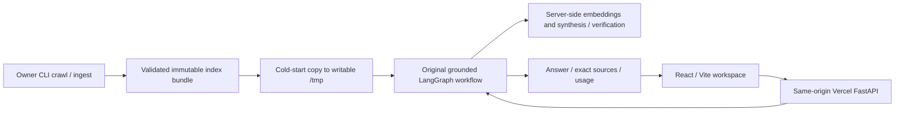
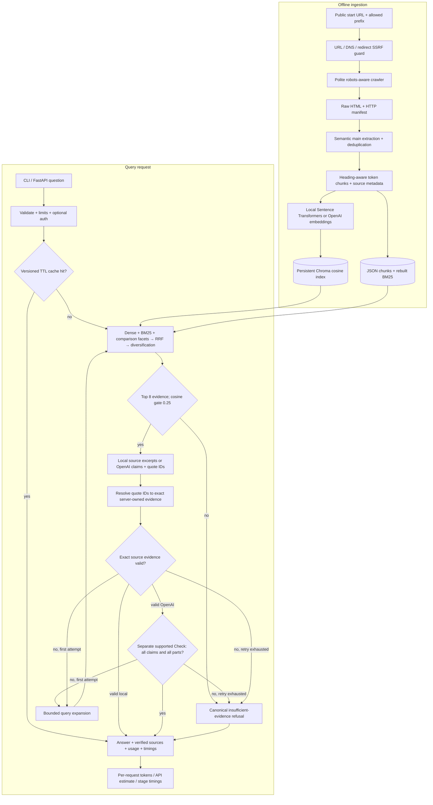
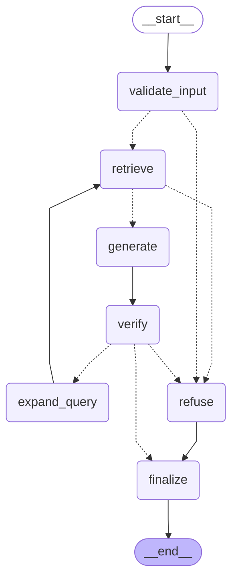

# Architecture

## Deployed application

The compiled UI and full question-answering backend run together on Vercel. The corpus is durable in the bundle; instance caches and rate limits are ephemeral. Crawling/reingestion remains an owner-operated CLI step, followed by preparation and redeployment. See [deployment instructions](VERCEL.md).

The main measured assessment path uses OpenAI `text-embedding-3-small` retrieval and `gpt-4o-mini` structured synthesis, followed by a separate semantic `Check` verdict. The credential-free local fallback uses real Sentence Transformers embeddings and returns source excerpts. `Settings` still defaults to local mode; the recorded provider configuration identifies the main run. Both paths share deterministic citation verification and bounded LangGraph control flow. Website content is untrusted data and has no execution privileges.

Metadata flows from the original page URL/title/heading through each stable chunk ID into retrieval hits and citation validation. The response URL is taken from stored chunk metadata; a model cannot invent a new citation URL. Embedding identity and index version prevent querying incompatible collections or reusing answers from an old corpus. A changed corpus requires deliberate ingestion.

OpenAI generation receives a table of exact source quotations identified as `q001`, `q002`, and so on. Each structured claim selects its quote ID and matching chunk ID. The server restores the actual quotation; unknown references or mismatched chunks remain invalid. It validates source occurrence, literal case, and provenance before a separate semantic prompt judges entailment and completeness. Unusable proposed claims may be removed before that complete-answer verdict, so the verdict must reject any resulting omission. This is a guardrail, not independent human verification or an unconditional correctness guarantee.

`Draft.answerable` means the website evidence supports an answer, including a supported negative answer or false-premise correction. It is not the truth value of a yes/no question. Explicit conjunction/comparison facets can reserve complementary dense evidence before the remaining top-eight slots are selected. The frozen relevance threshold is 0.25; source diversification remains a greedy URL penalty rather than full vector-pair MMR. Final evaluation and cost reports describe the recorded quality, errors, token usage, and latency of this configuration.

The rendered SVG is a dependency-free depiction of this flow. The compiled LangGraph diagram is captured below after the graph exists; it is separate from the full product architecture above.

<!-- GENERATED_GRAPH_START -->

<!-- GENERATED_GRAPH_END -->
