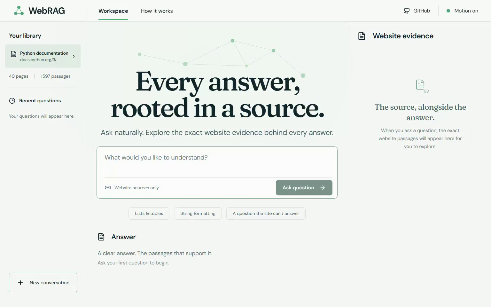
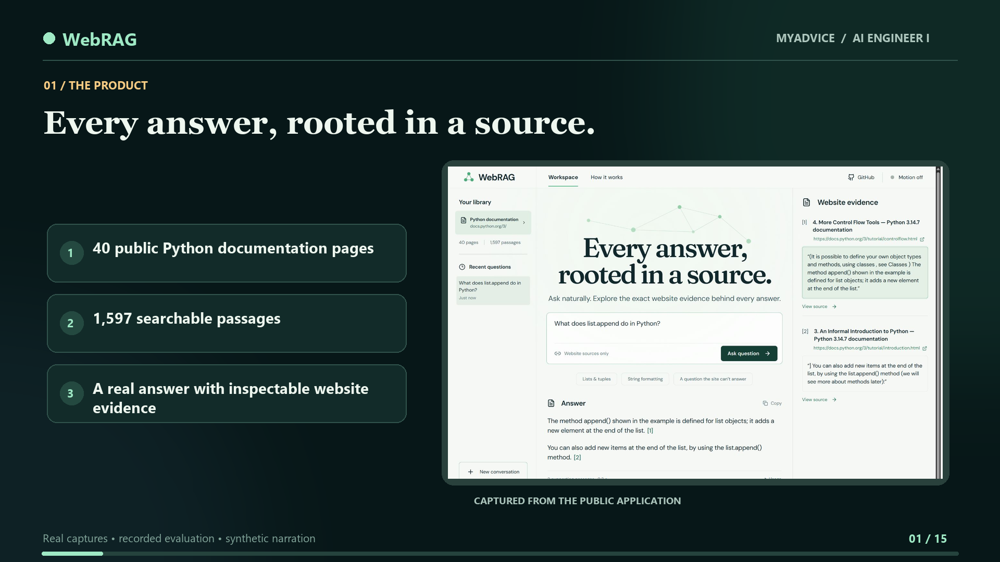
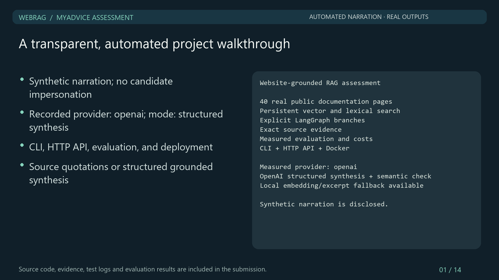

# Assessment walkthroughs

## Primary: live browser demonstration

[Watch or download the live browser walkthrough](WebRAG-Live-Browser-Walkthrough.mp4) — **11 minutes 37 seconds**, including **7 minutes 54 seconds in the public application** followed by the actual published GitHub README. The 1536×960 H.264 MP4 has audible AAC synthetic narration and a default selectable English subtitle track. [Separate SRT captions](WebRAG-Live-Browser-Walkthrough.srt) · [full transcript](WebRAG-Live-Browser-Walkthrough-Transcript.md) · [recording plan](LIVE_BROWSER_PLAN.md) · [verification](../verification/live-browser-video.json).

The candidate's webcam is damaged, as disclosed in the opening and closing narration. The voice is synthetic and is not represented as the candidate's own. Actual Chromium captures show the public Vercel app answering straightforward, comparison, and misleading questions; refusing a weather request; exposing sources, timing, usage, copy-with-sources, history, motion, and mobile evidence; then visiting the published GitHub cover, poster, architecture, screenshots, technical detail, and cost table. The exact browser actions and narration are in `scripts/record_live_browser_demo.py` and `scripts/live_demo_content.json`. The recording is a demonstration, not a new independent model evaluation.

## Additional technical walkthrough

[Play or download the current walkthrough](WebRAG-Assessment-Showcase.mp4) — **14 minutes 15 seconds**, 1920×1080 H.264 video, AAC narration, and an embedded selectable English subtitle track. [Separate captions](WebRAG-Assessment-Showcase.srt) · [full transcript](WebRAG-Assessment-Showcase-Transcript.md) · [storyboard and research](SHOWCASE_PLAN.md).

The candidate's webcam is damaged. This is a screen presentation with **disclosed synthetic neural narration**, not a claim about his voice or a webcam recording. The public app captures, source evidence, architecture image, and evaluation/cost numbers come from the deployed application and saved repository records. The 15 chapters cover the full crawl-to-answer architecture, desktop and mobile UI, source citations, a misleading-question correction, a real unsupported-question refusal, interaction details, evaluation limitations, cost scenarios, deployment, and next improvements. The [new architecture diagram](../architecture-showcase.png) appears from approximately **0:52 to 1:55**; it was pushed to GitHub before video production.

The current video is generated from `scripts/showcase_content.json`, `scripts/create_showcase_video.py`, and `scripts/synthesize_showcase.py`. The exact public captures used in the video are in `docs/video/assets/`. [Media verification](../verification/showcase-video.json) records duration, streams, decoding, caption count, and download-copy hash. Video rendering is supplementary and not needed to run the RAG service.

## Historical walkthrough

[Play or download the walkthrough](WebRAG-Walkthrough.mp4) — **12 minutes 14 seconds**, H.264 video and AAC audio, 1920×1080. [Transcript](transcript.md).

The video uses **disclosed synthetic narration**, real saved HTTP responses, and the final 38-question OpenAI evaluation, including 12 fresh independent holdout questions. It covers setup, architecture, crawl/chunk decisions, real embeddings, retrieval, grounding, queries, evaluation failures, costs, security, and deployment. It does not represent the candidate's voice or webcam presentation. A personal presentation can use [the prepared script](../VIDEO_SCRIPT.md).

[Verification metadata](../verification/video.json) records its source run, duration, SHA-256, codecs, and successful decoding at the beginning, middle, and end. Rendering sources are in `scripts/create_walkthrough.py`, `scripts/synthesize_walkthrough.ps1`, and `scripts/walkthrough_content.json`. Rendering uses optional Pillow and imageio-ffmpeg; these are not needed to run the RAG service.

The recording covers the original paid run `20260929T142544Z`, before the subsequent React UI, Vercel deployment, and known-refusal repairs. It is historical evidence, not a recording of the deployed revision. For current results and the live demo, use [the repository follow-up status](../../README.md#follow-up-deployment-and-refusal-repairs) and [the live application](https://webrag-assessment.vercel.app).
